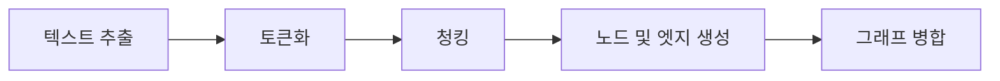

# BrainTrace

<p align="center"><i>지식 그래프를 활용한 지식 관리 시스템</i></p>

BrainTrace는 업로드된 텍스트와 문서에서 정보를 추출하여 지식 그래프로 구성합니다. 이를 통해 의미론적 검색, 출처 추적, 시각적 탐색을 하나의 흐름에서 제공합니다. 파일 간의 분산된 개념과 관계를 하나의 네트워크로 연결하여 문서 간 맥락을 재구성하고, 그래프 기반의 통찰력 발견과 증거 중심의 인용을 지원합니다. 단순한 개념 추출을 넘어, 텍스트를 노드-엣지 구조로 변환하여 의미론적 탐색과 문서 간 참조, 지식 시각화를 원활하게 경험할 수 있습니다.

---

## 시스템 아키텍처


---

## 지식 그래프 파이프라인

BrainTrace는 다양한 유형의 학습 자료를 다음의 다섯 단계로 지식 그래프로 변환합니다:



1. **텍스트 추출**:
   PDF, 텍스트 파일, 메모, Markdown, DOCX 등의 소스에서 텍스트를 추출합니다.

   ```python
   # backend/routers/brain_graph.py (발췌)
   @router.get("/getSourceContent",
       summary="소스 파일의 텍스트 내용 가져오기",
       description="주어진 source_id에 대한 파일 유형에 따라 텍스트 내용을 반환합니다.")
   async def get_source_content(source_id: str, brain_id: str):
       db = SQLiteHandler()
       pdf = db.get_pdf(int(source_id))
       textfile = db.get_textfile(int(source_id))
       memo = db.get_memo(int(source_id))
       md = db.get_mdfile(int(source_id))
       docx = db.get_docxfile(int(source_id))
       if pdf:
           content = pdf.get('pdf_text', '')
           title = pdf.get('pdf_title', '')
           file_type = 'pdf'
       elif textfile:
           content = textfile.get('txt_text', '')
           title = textfile.get('txt_title', '')
           file_type = 'textfile'
       # ... (memo/md/docx 분기에도 제목 포함)
       return {"content": content, "title": title, "type": file_type}
   ```

2. **토큰화**:
   추출된 텍스트를 의미 있는 단위(문장, 명사구 등)로 분할합니다.

   ```python
   # backend/services/embedding_service.py (발췌)
   def encode_text(text: str) -> List[float]:
       """
       주어진 텍스트를 KoE5 모델로 임베딩하여 벡터 반환
       - 토크나이저로 입력 전처리
       - CLS 토큰 임베딩 추출
       """
       try:
           inputs = tokenizer(text, return_tensors="pt", truncation=True, padding=True)
           with torch.no_grad():
               outputs = model(**inputs)
           return outputs.last_hidden_state[:, 0].squeeze().tolist()
       except Exception as e:
           logging.error("텍스트 임베딩 생성 실패: %s", str(e))
   ```

3. **청킹**:
   주제별로 유사한 내용을 작은 청크로 그룹화하여 그래프의 골격을 준비합니다.

   ```python
   # backend/services/manual_chunking_sentences.py (발췌)
   def extract_graph_components(text: str, source_id: str):
       tokenized, sentences = split_into_tokenized_sentence(text)
       if len(text) >= 2000:
           chunks, nodes_and_edges, _ = recurrsive_chunking(tokenized, source_id, 0, [], "", 0)
           all_nodes = nodes_and_edges["nodes"]
           all_edges = nodes_and_edges["edges"]
       else:
           # 짧은 텍스트 처리 (주제 추출 + 단일 청크)
           top_keyword, _, _ = lda_keyword_and_similarity(tokenized, None, None)
       return all_nodes, all_edges
   ```

4. **노드 및 엣지 생성**:
   각 청크에서 개념(노드)과 관계(엣지)를 추출합니다.

   ```python
   # backend/services/ollama_service.py (발췌)
   def _extract_from_chunk(self, chunk: str, source_id: str) -> Tuple[List[Dict], List[Dict]]:
       # ... LLM 응답을 구문 분석하고 유효한 노드/엣지를 정규화합니다.
       sentences = manual_chunking(chunk)
       if not sentences:
           for node in valid_nodes:
               node["original_sentences"] = []
           return valid_nodes, valid_edges
       sentence_embeds = np.vstack([encode_text(s) for s in sentences])
       threshold = 0.8
       for node in valid_nodes:
           if not node["descriptions"]:
               node["original_sentences"] = []
               continue
           desc_obj = node["descriptions"][0]
           desc_vec = np.array(encode_text(desc_obj["description"]))
           sim_scores = cosine_similarity(sentence_embeds, desc_vec.reshape(1, -1)).flatten()
           above = [(i, score) for i, score in enumerate(sim_scores) if score >= threshold]
           node_originals = []
           if above:
               for i, score in above:
                   node_originals.append({
                       "original_sentence": sentences[i],
                       "source_id": desc_obj["source_id"],
                       "score": round(float(score), 4)
                   })
           else:
               best_i = int(np.argmax(sim_scores))
               node_originals.append({
                   "original_sentence": sentences[best_i],
                   "source_id": desc_obj["source_id"],
                   "score": round(float(sim_scores[best_i]), 4)
               })
           node["original_sentences"] = node_originals
       return valid_nodes, valid_edges
   ```

5. **그래프 병합**:
   모든 청크에서 노드/엣지를 통합된 지식 그래프로 병합합니다.
   ```python
   # backend/neo4j_db/Neo4jHandler.py (발췌)
   def insert_nodes_and_edges(self, nodes, edges, brain_id):
       def _insert(tx, nodes, edges, brain_id):
           for node in nodes:
               new_descriptions = [json.dumps(d, ensure_ascii=False) for d in node.get("descriptions", []) if isinstance(d, dict)]
               new_originals = [json.dumps(o, ensure_ascii=False) for o in node.get("original_sentences", []) if isinstance(o, dict)]
               tx.run(
                   """
                   MERGE (n:Node {name: $name, brain_id: $brain_id})
                   ON CREATE SET n.label=$label, n.descriptions=$new_descriptions, n.original_sentences=$new_originals
                   ON MATCH SET  n.label=$label,
                                 n.descriptions = CASE WHEN n.descriptions IS NULL THEN $new_descriptions ELSE n.descriptions + [item IN $new_descriptions WHERE NOT item IN n.descriptions] END,
                                 n.original_sentences = CASE WHEN n.original_sentences IS NULL THEN $new_originals ELSE n.original_sentences + [item IN $new_originals WHERE NOT item IN n.original_sentences] END
                   """,
                   name=node["name"], label=node["label"], new_descriptions=new_descriptions, new_originals=new_originals, brain_id=brain_id
               )
           for edge in edges:
               tx.run(
                   """
                   MATCH (a:Node {name:$source, brain_id:$brain_id})
                   MATCH (b:Node {name:$target, brain_id:$brain_id})
                   MERGE (a)-[r:REL {relation:$relation, brain_id:$brain_id}]->(b)
                   """,
                   source=edge["source"], target=edge["target"], relation=edge["relation"], brain_id=brain_id
               )
   ```

---

## 청킹 함수의 동작

청킹 함수는 재귀적으로 호출되며 다음 동작을 반복합니다:


동작 절차:

1. **명사구 추출**: 텍스트를 문장 단위로 분할하고 명사구를 추출합니다. 이 단계에서는 텍스트를 분석하여 각 문장을 개별적으로 처리하고, 명사구를 식별하여 추출합니다.

   ```python
   # backend/services/manual_chunking_sentences.py (발췌)
   def extract_graph_components(text: str, source_id: str):
       tokenized, sentences = split_into_tokenized_sentence(text)
       if len(text) >= 2000:
           chunks, nodes_and_edges, _ = recurrsive_chunking(tokenized, source_id, 0, [], "", 0)
           all_nodes = nodes_and_edges["nodes"]
           all_edges = nodes_and_edges["edges"]
       else:
           # 짧은 텍스트 처리 (주제 추출 + 단일 청크)
           top_keyword, _, _ = lda_keyword_and_similarity(tokenized, None, None)
       return all_nodes, all_edges
   ```

2. **LDA 모듈을 통한 주제 벡터 변환**: 각 문장을 주제 벡터로 변환합니다. LDA 모듈을 사용하여 문장의 주제를 분석하고, 이를 벡터 형태로 변환하여 주제 간의 관계를 파악합니다.

   ```python
   # backend/services/embedding_service.py (발췌)
   def encode_text(text: str) -> List[float]:
       """
       주어진 텍스트를 KoE5 모델로 임베딩하여 벡터 반환
       - 토크나이저로 입력 전처리
       - CLS 토큰 임베딩 추출
       """
       try:
           inputs = tokenizer(text, return_tensors="pt", truncation=True, padding=True)
           with torch.no_grad():
               outputs = model(**inputs)
           return outputs.last_hidden_state[:, 0].squeeze().tolist()
       except Exception as e:
           logging.error("텍스트 임베딩 생성 실패: %s", str(e))
   ```

3. **문장 유사도 계산 및 그룹화**: 문장쌍 간의 유사도를 계산하고, 하위 25% 이하의 유사도를 기준으로 그룹화합니다. 유사도 행렬을 구성하여 문장 간의 유사성을 평가하고, 이를 기반으로 문장을 그룹화합니다.

   ```python
   # backend/services/embedding_service.py (발췌)
   def search_similar_nodes(
       embedding: List[float],
       brain_id: str,
       limit: int = 3,
       threshold: float = 0.5,
       high_score_threshold: float = 0.8
   ) -> List[Dict]:
       # 유사도 계산 및 그룹화 로직
   ```

4. **Grouping**: 주제적으로 다른 문장들 사이를 경계로 삼아 청크를 구성합니다. 이 단계에서는 유사도가 낮은 문장들 사이를 경계로 삼아 청크를 형성합니다.

   ```python
   # backend/services/ollama_service.py (발췌)
   def _extract_from_chunk(self, chunk: str, source_id: str) -> Tuple[List[Dict], List[Dict]]:
       # ... LLM 응답을 구문 분석하고 유효한 노드/엣지를 정규화합니다.
       sentences = manual_chunking(chunk)
       if not sentences:
           for node in valid_nodes:
               node["original_sentences"] = []
           return valid_nodes, valid_edges
       sentence_embeds = np.vstack([encode_text(s) for s in sentences])
       threshold = 0.8
       for node in valid_nodes:
           if not node["descriptions"]:
               node["original_sentences"] = []
               continue
           desc_obj = node["descriptions"][0]
           desc_vec = np.array(encode_text(desc_obj["description"]))
           sim_scores = cosine_similarity(sentence_embeds, desc_vec.reshape(1, -1)).flatten()
           above = [(i, score) for i, score in enumerate(sim_scores) if score >= threshold]
           node_originals = []
           if above:
               for i, score in above:
                   node_originals.append({
                       "original_sentence": sentences[i],
                       "source_id": desc_obj["source_id"],
                       "score": round(float(score), 4)
                   })
           else:
               best_i = int(np.argmax(sim_scores))
               node_originals.append({
                   "original_sentence": sentences[best_i],
                   "source_id": desc_obj["source_id"],
                   "score": round(float(sim_scores[best_i]), 4)
               })
           node["original_sentences"] = node_originals
       return valid_nodes, valid_edges
   ```

---

지식 그래프에 대한 설명은 [여기](./KNOWLEDGE_GRAPH.md)에서 확인할 수 있습니다.

---

## 출력 화면

<table style="background-color:#ffffff; border-collapse:separate; border-spacing:10px;">
  <tr>
    <td width="50%" valign="top" style="padding:0; background-color:#ffffff; border:2px solid #000000;">
      
      <div align="center"><b>새 프로젝트 생성</b></div>
      <div align="center"><sub>프로젝트 이름과 환경을 선택하여 새 프로젝트를 시작할 수 있습니다.</sub></div>
    </td>
    <td width="50%" valign="top" style="padding:0; background-color:#ffffff; border:2px solid #000000;">
      
      <div align="center"><b>업로드 시 그래프 생성</b></div>
      <div align="center"><sub>파일을 업로드하면 자동으로 텍스트에 대한 노드와 엣지가 생성되어 그래프에 반영됩니다. PDF, TXT, MD, DOCX, 메모 형식을 지원합니다.</sub></div>
    </td>
  </tr>
  <tr><td colspan="2" style="height:16px;"></td></tr>
  <tr style="background-color:#ffffff;">
    <td width="50%" valign="top" style="padding:0; background-color:#ffffff; border:2px solid #000000;">
      
      <div align="center"><b>소스 하이라이팅</b></div>
      <div align="center"><sub>특정 소스를 클릭하여 내용을 확인하고 하이라이팅할 수 있습니다.</sub></div>
    </td>
    <td width="50%" valign="top" style="padding:0; background-color:#ffffff; border:2px solid #000000;">
      
      <div align="center"><b>Q&A 후 참조된 노드</b></div>
      <div align="center"><sub>AI에게 질문 후 답변에 사용된 노드를 그래프 뷰에서 확인할 수 있습니다.</sub></div>
    </td>
  </tr>
  <tr><td colspan="2" style="height:16px;"></td></tr>
  <tr style="background-color:#ffffff;">
    <td width="50%" valign="top" style="padding:0; background-color:#ffffff; border:2px solid #000000;">
      
      <div align="center"><b>출처 보기</b></div>
      <div align="center"><sub>AI 답변에 사용된 노드가 어떤 소스를 참고했는지 확인할 수 있습니다.</sub></div>
    </td>
    <td width="50%" valign="top" style="padding:0; background-color:#ffffff; border:2px solid #000000;">
      
      <div align="center"><b>소스 노드 보기</b></div>
      <div align="center"><sub>특정 소스가 생성한 노드를 그래프 뷰에서 확인할 수 있습니다.</sub></div>
    </td>
  </tr>
  <tr><td colspan="2" style="height:16px;"></td></tr>
  <tr style="background-color:#ffffff;">
    <td width="50%" valign="top" style="padding:8px; background-color:#ffffff; border:2px solid #000000;">
      
      <div align="center"><b>메모 작성 및 소스로 추가</b></div>
      <div align="center"><sub>메모를 작성하고 소스로 변환하여 그래프에 반영할 수 있습니다.</sub></div>
    </td> 
    <td width="50%" valign="top" style="padding:8px; background-color:#ffffff; border:2px solid #000000;">
      
      <div align="center"><b>음성에서 메모 생성</b></div>
      <div align="center"><sub>녹음된 오디오를 텍스트로 변환하여 메모로 저장합니다.</sub></div>
    </td>
  </tr>
  <tr><td colspan="2" style="height:16px;"></td></tr>
  <tr style="background-color:#ffffff;">
    <td width="50%" valign="top" style="padding:0; background-color:#ffffff; border:2px solid #000000;">
      
      <div align="center"><b>소스 삭제</b></div>
      <div align="center"><sub>특정 소스를 삭제하면 해당 소스로 생성된 노드도 함께 삭제됩니다.</sub></div>
    </td>
    <td width="50%" valign="top" style="padding:0; background-color:#ffffff; border:2px solid #000000;">
      
      <div align="center"><b>탐색 기능</b></div>
      <div align="center"><sub>파일 내용이나 키워드를 입력하여 유사한 소스를 찾을 수 있습니다.</sub></div>
    </td>
  </tr>
  <tr><td colspan="2" style="height:16px;"></td></tr>
   <tr>
  <td width="50%" valign="top" style="padding:0; background-color:#ffffff; border:2px solid #000000;">
     
    </p>
    <div align="center"><b>전체 화면 라이트모드 노드 검색</b></div>
    <div align="center"><sub>노드 검색 기능을 통해 원하는 노드로 카메라를 이동시킵니다.</sub></div>
    </td>
    <td width="50%" valign="top" style="padding:0; background-color:#ffffff; border:2px solid #000000;">
      
      <div align="center"><b>전체 화면 다크 모드</b></div>
      <div align="center"><sub>어두운 테마의 전체 화면에서 그래프를 탐색하며, 그래프 속성을 자유롭게 커스터마이징할 수 있습니다.</sub></div>
    </td>
  </tr>
</table>

---

## 데모 비디오

## ⬇️ 비디오 보기

- 링크 곧 제공 예정.

---

<br />

## 귀요미들

|                            Full Stack                             |                                Backend                                 |                               DevOps                               |                                AI                                 |
| :---------------------------------------------------------------: | :--------------------------------------------------------------------: | :----------------------------------------------------------------: | :---------------------------------------------------------------: |
|  |  |  |  |
|              [Yechan An](https://github.com/yes6686)              |            [Donghyck Kim](https://github.com/kimdonghyuk0)             |            [JeongGyun Yu](https://github.com/Mieulchi)             |             [Selyn Jang](https://github.com/selyn-a)              |
