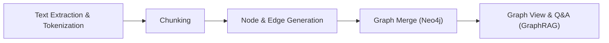

## Introduction

<p align="center"><i>A knowledge management system powered by knowledge graphs</i></p>

BrainTrace extracts information from uploaded texts/documents, organizes it into a knowledge graph, and enables semantic search, provenance tracking, and visual exploration in a single flow. It connects dispersed concepts and relations across files into one network to reconstruct cross-document context, supporting graph-based insight discovery, evidence-centered citation, and relation-first navigation. Beyond simple concept extraction, it transforms text into a node–edge structure to provide semantic exploration, cross-document references, and knowledge visualization as one seamless experience.

---

## System Architecture


---

## Knowledge Graph Pipeline

BrainTrace converts various types of learning materials into a knowledge graph through the following five steps:



1. Text Extraction & Tokenization:
   Extract text from sources such as PDFs, text files, memos, Markdown, or DOCX, then split it into meaningful units (sentences, noun phrases, etc.).
   In short, convert reading-friendly sentences into analysis-ready segments.

   ```python
   # backend/routers/brain_graph.py (excerpt)
   @router.get("/getSourceContent",
       summary="Get text content of a source file",
       description="Return text content based on file type for a given source_id.")
   async def get_source_content(source_id: str, brain_id: str):
       db = SQLiteHandler()
       pdf = db.get_pdf(int(source_id))
       textfile = db.get_textfile(int(source_id))
       memo = db.get_memo(int(source_id))
       md = db.get_mdfile(int(source_id))
       docx = db.get_docxfile(int(source_id))
       if pdf:
           content = pdf.get('pdf_text', '')
           title = pdf.get('pdf_title', '')
           file_type = 'pdf'
       elif textfile:
           content = textfile.get('txt_text', '')
           title = textfile.get('txt_title', '')
           file_type = 'textfile'
       # ... (include title in memo/md/docx branches as well)
       return {"content": content, "title": title, "type": file_type}
   ```

2. Chunking:
   Group similar content by topic into smaller chunks. Each chunk is labeled with representative keywords to prepare the skeleton of the graph.

   ```python
   # backend/services/manual_chunking_sentences.py (excerpt)
   def extract_graph_components(text: str, source_id: str):
       tokenized, sentences = split_into_tokenized_sentence(text)
       if len(text) >= 2000:
           chunks, nodes_and_edges, _ = recurrsive_chunking(tokenized, source_id, 0, [], "", 0)
           all_nodes = nodes_and_edges["nodes"]
           all_edges = nodes_and_edges["edges"]
       else:
           # Short text handling (topic extraction + single chunk)
           top_keyword, _, _ = lda_keyword_and_similarity(tokenized, None, None)
           # ...
       # ...
       return all_nodes, all_edges
   ```

3. Node & Edge Generation:
   From each chunk, extract concepts (nodes) and relations (edges), such as Cause→Effect, Part→Whole, Concept→Example.
   For evidence and traceability, we attach original sentences to each node as `original_sentences`.

   ```python
   # backend/services/ollama_service.py (excerpt)
   def _extract_from_chunk(self, chunk: str, source_id: str) -> Tuple[List[Dict], List[Dict]]:
       # ... parse LLM response and normalize valid nodes/edges
       sentences = manual_chunking(chunk)
       if not sentences:
           for node in valid_nodes:
               node["original_sentences"] = []
           return valid_nodes, valid_edges
       sentence_embeds = np.vstack([encode_text(s) for s in sentences])
       threshold = 0.8
       for node in valid_nodes:
           if not node["descriptions"]:
               node["original_sentences"] = []
               continue
           desc_obj = node["descriptions"][0]
           desc_vec = np.array(encode_text(desc_obj["description"]))
           sim_scores = cosine_similarity(sentence_embeds, desc_vec.reshape(1, -1)).flatten()
           above = [(i, score) for i, score in enumerate(sim_scores) if score >= threshold]
           node_originals = []
           if above:
               for i, score in above:
                   node_originals.append({
                       "original_sentence": sentences[i],
                       "source_id": desc_obj["source_id"],
                       "score": round(float(score), 4)
                   })
           else:
               best_i = int(np.argmax(sim_scores))
               node_originals.append({
                   "original_sentence": sentences[best_i],
                   "source_id": desc_obj["source_id"],
                   "score": round(float(sim_scores[best_i]), 4)
               })
           node["original_sentences"] = node_originals
       return valid_nodes, valid_edges
   ```

4. Graph Merge:
   Merge nodes/edges from all chunks into a unified knowledge graph. Identical concepts are automatically merged, and descriptions/provenance sentences are deduplicated.

   ```python
   # backend/neo4j_db/Neo4jHandler.py (excerpt)
   def insert_nodes_and_edges(self, nodes, edges, brain_id):
       def _insert(tx, nodes, edges, brain_id):
           for node in nodes:
               new_descriptions = [json.dumps(d, ensure_ascii=False) for d in node.get("descriptions", []) if isinstance(d, dict)]
               new_originals = [json.dumps(o, ensure_ascii=False) for o in node.get("original_sentences", []) if isinstance(o, dict)]
               tx.run(
                   """
                   MERGE (n:Node {name: $name, brain_id: $brain_id})
                   ON CREATE SET n.label=$label, n.descriptions=$new_descriptions, n.original_sentences=$new_originals
                   ON MATCH SET  n.label=$label,
                                 n.descriptions = CASE WHEN n.descriptions IS NULL THEN $new_descriptions ELSE n.descriptions + [item IN $new_descriptions WHERE NOT item IN n.descriptions] END,
                                 n.original_sentences = CASE WHEN n.original_sentences IS NULL THEN $new_originals ELSE n.original_sentences + [item IN $new_originals WHERE NOT item IN n.original_sentences] END
                   """,
                   name=node["name"], label=node["label"], new_descriptions=new_descriptions, new_originals=new_originals, brain_id=brain_id
               )
           for edge in edges:
               tx.run(
                   """
                   MATCH (a:Node {name:$source, brain_id:$brain_id})
                   MATCH (b:Node {name:$target, brain_id:$brain_id})
                   MERGE (a)-[r:REL {relation:$relation, brain_id:$brain_id}]->(b)
                   """,
                   source=edge["source"], target=edge["target"], relation=edge["relation"], brain_id=brain_id
               )
   ```

5. Graph View & Q&A (GraphRAG):
   The final graph is visualized. Questions are embedded with KoE5 → similar nodes are searched in Qdrant → related subgraphs are fetched from Neo4j → the LLM generates an answer based on the schema summary (with referenced nodes and provenance).

   ```python
   # backend/routers/brain_graph.py (excerpt)
   if not embedding_service.is_index_ready(brain_id):
       embedding_service.initialize_collection(brain_id)
   question_embedding = embedding_service.encode_text(question)
   similar_nodes, Q = embedding_service.search_similar_nodes(
       embedding=question_embedding, brain_id=brain_id
   )
   neo4j_handler = Neo4jHandler()
   result = neo4j_handler.query_schema_by_node_names(similar_node_names, brain_id)
   raw_schema_text = ai_service.generate_schema_text(nodes_result, related_nodes_result, relationships_result)
   final_answer = ai_service.generate_answer(raw_schema_text, question)
   ```

---

## Output Screens

<table style="background:#ffffff;">
  <tr>
    <td width="50%" valign="top" style="padding:0; background:#ffffff;">
      
      <div align="center"><b>Create a New Project</b></div>
      <div align="center"><sub>Create a new brain, set project name/settings, then start building the graph by uploading sources (sample project supported).</sub></div>
    </td>
    <td width="50%" valign="top" style="padding:0; background:#ffffff;">
      
      <div align="center"><b>Graph Generation on Upload</b></div>
      <div align="center"><sub>Nodes and edges are created as you upload files and immediately reflected in the graph (supports PDF/TXT/MD/DOCX/Memo).</sub></div>
    </td>
  </tr>
  <tr><td colspan="2" style="height:16px;"></td></tr>
  <tr style="background:#ffffff;">
    <td width="50%" valign="top" style="padding:0; background:#ffffff;">
      
      <div align="center"><b>Highlight by Source</b></div>
      <div align="center"><sub>Only nodes/edges originating from the selected source are highlighted; graph and source panels stay in sync.</sub></div>
    </td>
    <td width="50%" valign="top" style="padding:0; background:#ffffff;">
      
      <div align="center"><b>Show Referenced Nodes after Q&A</b></div>
      <div align="center"><sub>Nodes most relevant to the question are displayed in both the graph and a list, improving the answer with graph context.</sub></div>
    </td>
  </tr>
  <tr><td colspan="2" style="height:16px;"></td></tr>
  <tr style="background:#ffffff;">
    <td width="50%" valign="top" style="padding:0; background:#ffffff;">
      
      <div align="center"><b>View Provenance</b></div>
      <div align="center"><sub>Quickly verify evidence with original sentences and metadata such as file/page info.</sub></div>
    </td>
    <td width="50%" valign="top" style="padding:0; background:#ffffff;">
      
      <div align="center"><b>Referenced Node List & Source Nodes</b></div>
      <div align="center"><sub>Show nodes referenced in the chat answer and nodes produced from sources.</sub></div>
    </td>
  </tr>
  <tr><td colspan="2" style="height:16px;"></td></tr>
  <tr style="background:#ffffff;">
    <td width="50%" valign="top" style="padding:8px; background:#ffffff;">
      
      <div align="center"><b>Create Memo and Add as Source</b></div>
      <div align="center"><sub>Promote memos to sources and reflect them in the graph, connecting insights to knowledge with immediate graph updates.</sub></div>
    </td> 
    <td width="50%" valign="top" style="padding:8px; background:#ffffff;">
      
      <div align="center"><b>Create Memo from Voice</b></div>
      <div align="center"><sub>Transcribe recorded audio into text memos and optionally add them as sources to update the graph.</sub></div>
    </td>
  </tr>
   <tr>
  <td width="50%" valign="top" style="padding:0; background:#ffffff;">
     
    </p>
    <div align="center"><b>Fullscreen Light Mode Search</b></div>
    <div align="center"><sub>Type keywords to quickly explore target nodes and surrounding context in the fullscreen graph.</sub></div>
    </td>
    <td width="50%" valign="top" style="padding:0; background:#ffffff;">
      
      <div align="center"><b>Fullscreen Dark Mode</b></div>
      <div align="center"><sub>Explore the graph in a dark-themed fullscreen view—great for night-time or large-scale graph exploration.</sub></div>
    </td>
  </tr>
</table>

---

## Demo Video

## ⬇️ Watch the Video

- Link coming soon.

---

<br />

## Team

|                            Full-Stack                             |                                Backend                                 |                               DevOps                               |                                AI                                 |
| :---------------------------------------------------------------: | :--------------------------------------------------------------------: | :----------------------------------------------------------------: | :---------------------------------------------------------------: |
|  |  |  |  |
|              [Yechan An](https://github.com/yes6686)              |            [Donghyck Kim](https://github.com/kimdonghyuk0)             |            [JeongGyun Yu](https://github.com/Mieulchi)             |             [Selyn Jang](https://github.com/selyn-a)              |
