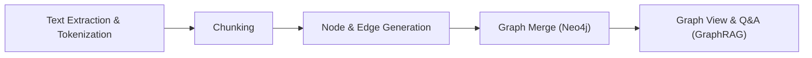

## 소개

<i>문서를 그래프로 연결하는 지식 운영 플랫폼</i>

BrainTrace는 사용자가 업로드한 텍스트/문서에서 정보를 추출해 지식 그래프 구조로 정리하고, 이를 바탕으로 의미 기반 탐색, 출처 추적, 시각 탐색이 자연스럽게 이어지도록 돕는 통합 플랫폼입니다. 분산된 문서 속 개념과 관계를 하나의 연결망으로 묶어 문서 간 주제 맥락을 재구성하고, 그래프 기반 인사이트 탐색·근거 중심 인용·관계 중심 내비게이션을 지원합니다. 단순한 개념 추출을 넘어 텍스트를 노드·엣지 구조로 변환하여 의미 연관 탐색, 다문서 교차 참조, 지식 시각화를 한 흐름 안에서 제공합니다.

---

## 시스템 전체 아키텍처

---

## 지식그래프 생성 과정

BrainTrace는 다양한 형식의 학습 자료를 아래의 5단계 과정을 통해 지식 그래프로 변환합니다:

1. Text Extraction & Tokenization
   PDF, 텍스트, DOCX, MD, 메모 등에서 텍스트를 추출한 뒤,
   문장/구 단위로 분리하고 필요 시 명사구 중심 키워드를 추출합니다.

2. Chunking
   길이/문맥 기준의 규칙 기반 청킹으로 텍스트를 주제별 청크로 분할하고,
   각 청크의 중심 키워드를 기준으로 그래프의 뼈대를 구성합니다.

3. Node & Edge Generation
   각 청크에서 LLM(OpenAI/Ollama) 또는 규칙 기반 로직으로 개념(노드)과 관계(엣지)를 추출합니다.
   이때 관계는 '원인', '구성요소', '예시' 등 의미 있는 연결로 정의됩니다.
   또한 description과 문장 임베딩 유사도를 이용해 original_sentences(출처 문장)를 매핑합니다.

4. Graph Merge
   모든 청크에서 추출된 노드와 엣지를 Neo4j에 MERGE로 저장하고,
   descriptions·original_sentences는 중복 없이 병합하여 일관된 구조를 유지합니다.

5. Graph View & Q&A (GraphRAG)
   최종 그래프는 시각화되며,
   질문은 KoE5 임베딩으로 벡터화 → Qdrant에서 유사 노드 검색 → Neo4j에서 관련 서브그래프 조회 →
   LLM이 스키마 요약을 바탕으로 답변을 생성합니다(참고 노드/출처 포함).

---

## Project Sample

 
 

> 문서를 업로드하면 BrainTrace가 자동으로 그래프를 구축합니다. 엔티티/관계를 탐색하고 추출된 스키마를 미리 볼 수 있습니다.

  

> **그래프 기반 컨텍스트**로 질문하세요. 응답에는 관련 출처와 그래프 경로가 함께 제공됩니다.

---

## Demo

## ⬇️ 영상 보러 가기

---

 

## 프로젝트 팀원

|                            Full-Stack                             |                                Backend                                 |                               DevOps                               |                                AI                                 |
| :---------------------------------------------------------------: | :--------------------------------------------------------------------: | :----------------------------------------------------------------: | :---------------------------------------------------------------: |
|  |  |  |  |
|              [Yechan An](https://github.com/yes6686)              |            [Donghyck Kim](https://github.com/kimdonghyuk0)             |            [JeongGyun Yu](https://github.com/Mieulchi)             |             [Selyn Jang](https://github.com/selyn-a)              |
