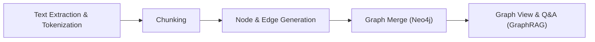

## 소개

<p align="center"><i>지식그래프를 활용한 지식 관리 시스템</i></p>

BrainTrace는 사용자가 업로드한 텍스트/문서에서 정보를 추출해 지식 그래프 구조로 정리하고, 이를 바탕으로 의미 기반 탐색, 출처 추적, 시각 탐색이 자연스럽게 이어지도록 돕는 통합 플랫폼입니다. 분산된 문서 속 개념과 관계를 하나의 연결망으로 묶어 문서 간 주제 맥락을 재구성하고, 그래프 기반 인사이트 탐색·근거 중심 인용·관계 중심 내비게이션을 지원합니다. 단순한 개념 추출을 넘어 텍스트를 노드·엣지 구조로 변환하여 의미 연관 탐색, 다문서 교차 참조, 지식 시각화를 한 흐름 안에서 제공합니다.

---

## 시스템 전체 아키텍처


---

## 지식그래프 생성 과정

BrainTrace는 다양한 형식의 학습 자료를 아래의 5단계 과정을 통해 지식 그래프로 변환합니다:



1. Text Extraction & Tokenization:
   PDF, 텍스트 파일, 메모 등 다양한 형식의 자료에서 글 내용을 뽑아낸 뒤, 그 안의 문장을 의미 있는 단위(문장, 명사 덩어리 등)로 잘게 나눕니다.
   쉽게 말하면, 읽기용 문장을 분석용 조각들로 나누는 과정입니다.

   ```python
   # backend/routers/brain_graph.py (발췌)
   @router.get("/getSourceContent",
       summary="소스 파일의 텍스트 내용 조회",
       description="특정 source_id의 파일 타입에 따라 텍스트 내용을 반환합니다.")
   async def get_source_content(source_id: str, brain_id: str):
       db = SQLiteHandler()
       pdf = db.get_pdf(int(source_id))
       textfile = db.get_textfile(int(source_id))
       memo = db.get_memo(int(source_id))
       md = db.get_mdfile(int(source_id))
       docx = db.get_docxfile(int(source_id))
       if pdf:
           content = pdf.get('pdf_text', '')
           file_type = 'pdf'
       elif textfile:
           content = textfile.get('txt_text', '')
           file_type = 'textfile'
       # ... (memo/md/docx 분기)
       return {"content": content, "type": file_type}
   ```

2. Chunking:
   긴 글을 주제별로 비슷한 내용끼리 묶어 작은 청크로 나눕니다.
   각 청크에는 대표 키워드를 붙여, 이후 그래프의 뼈대를 잡을 준비를 합니다.

   ```python
   # backend/services/manual_chunking_sentences.py (발췌)
   def extract_graph_components(text: str, source_id: str):
       tokenized, sentences = split_into_tokenized_sentence(text)
       if len(text) >= 2000:
           chunks, nodes_and_edges, _ = recurrsive_chunking(tokenized, source_id, 0, [], "", 0)
           all_nodes = nodes_and_edges["nodes"]
           all_edges = nodes_and_edges["edges"]
       else:
           # 짧은 텍스트 처리 (토픽 추출 후 단일 청크)
           top_keyword, _, _ = lda_keyword_and_similarity(tokenized, None, None)
           # ...
       # ...
       return all_nodes, all_edges
   ```

3. Node & Edge Generation:
   각 청크에서 개념(노드)과 개념 사이의 관계(엣지)를 찾아냅니다.
   예: ‘원인–결과’, ‘구성요소–전체’, ‘개념–예시’ 같은 의미 있는 연결입니다.
   왜 그렇게 판단했는지 근거를 보여주기 위해, 각 노드에 원문 문장(original_sentences)도 함께 연결합니다.

   ```python
   # backend/services/ollama_service.py (발췌)
   def _extract_from_chunk(self, chunk: str, source_id: str) -> Tuple[List[Dict], List[Dict]]:
       # ... LLM 응답 파싱 후 유효 노드/엣지 정규화
       sentences = manual_chunking(chunk)
       if not sentences:
           for node in valid_nodes:
               node["original_sentences"] = []
           return valid_nodes, valid_edges
       sentence_embeds = np.vstack([encode_text(s) for s in sentences])
       threshold = 0.8
       for node in valid_nodes:
           if not node["descriptions"]:
               node["original_sentences"] = []
               continue
           desc_obj = node["descriptions"][0]
           desc_vec = np.array(encode_text(desc_obj["description"]))
           sim_scores = cosine_similarity(sentence_embeds, desc_vec.reshape(1, -1)).flatten()
           above = [(i, score) for i, score in enumerate(sim_scores) if score >= threshold]
           node_originals = []
           if above:
               for i, score in above:
                   node_originals.append({
                       "original_sentence": sentences[i],
                       "source_id": desc_obj["source_id"],
                       "score": round(float(score), 4)
                   })
           else:
               best_i = int(np.argmax(sim_scores))
               node_originals.append({
                   "original_sentence": sentences[best_i],
                   "source_id": desc_obj["source_id"],
                   "score": round(float(sim_scores[best_i]), 4)
               })
           node["original_sentences"] = node_originals
       return valid_nodes, valid_edges
   ```

4. Graph Merge:
   청크별로 나온 노드/엣지를 합쳐 하나의 지식 그래프로 만듭니다.
   같은 개념은 자동 병합하고, 설명·출처 문장은 중복 없이 정리해 깔끔하게 유지합니다.

   ```python
   # backend/neo4j_db/Neo4jHandler.py (발췌)
   def insert_nodes_and_edges(self, nodes, edges, brain_id):
       def _insert(tx, nodes, edges, brain_id):
           for node in nodes:
               new_descriptions = [json.dumps(d, ensure_ascii=False) for d in node.get("descriptions", []) if isinstance(d, dict)]
               new_originals = [json.dumps(o, ensure_ascii=False) for o in node.get("original_sentences", []) if isinstance(o, dict)]
               tx.run(
                   """
                   MERGE (n:Node {name: $name, brain_id: $brain_id})
                   ON CREATE SET n.label=$label, n.descriptions=$new_descriptions, n.original_sentences=$new_originals
                   ON MATCH SET  n.label=$label,
                                 n.descriptions = CASE WHEN n.descriptions IS NULL THEN $new_descriptions ELSE n.descriptions + [item IN $new_descriptions WHERE NOT item IN n.descriptions] END,
                                 n.original_sentences = CASE WHEN n.original_sentences IS NULL THEN $new_originals ELSE n.original_sentences + [item IN $new_originals WHERE NOT item IN n.original_sentences] END
                   """,
                   name=node["name"], label=node["label"], new_descriptions=new_descriptions, new_originals=new_originals, brain_id=brain_id
               )
           for edge in edges:
               tx.run(
                   """
                   MATCH (a:Node {name:$source, brain_id:$brain_id})
                   MATCH (b:Node {name:$target, brain_id:$brain_id})
                   MERGE (a)-[r:REL {relation:$relation, brain_id:$brain_id}]->(b)
                   """,
                   source=edge["source"], target=edge["target"], relation=edge["relation"], brain_id=brain_id
               )
   ```

5. Graph View & Q&A (GraphRAG):
   최종 그래프는 시각화되며,
   질문은 KoE5 임베딩으로 벡터화 → Qdrant에서 유사 노드 검색 → Neo4j에서 관련 서브그래프 조회 →
   LLM이 스키마 요약을 바탕으로 답변을 생성합니다(참고 노드/출처 포함).

   ```python
   # backend/routers/brain_graph.py (발췌)
   if not embedding_service.is_index_ready(brain_id):
       embedding_service.initialize_collection(brain_id)
   question_embedding = embedding_service.encode_text(question)
   similar_nodes, Q = embedding_service.search_similar_nodes(
       embedding=question_embedding, brain_id=brain_id
   )
   neo4j_handler = Neo4jHandler()
   result = neo4j_handler.query_schema_by_node_names(similar_node_names, brain_id)
   raw_schema_text = ai_service.generate_schema_text(nodes_result, related_nodes_result, relationships_result)
   final_answer = ai_service.generate_answer(raw_schema_text, question)
   ```

---

## 결과물

<table style="background:#ffffff;">
  <tr>
    <td width="50%" valign="top" style="padding:0; background:#ffffff;">
      
      <div align="center"><b>새 프로젝트 만들기</b></div>
      <div align="center"><sub>새 브레인을 생성하고 프로젝트 이름/설정을 정한 뒤, 소스 업로드로 그래프 구축을 시작합니다(샘플 프로젝트 시작 지원).</sub></div>
    </td>
    <td width="50%" valign="top" style="padding:0; background:#ffffff;">
      
      <div align="center"><b>소스 첨부 시 그래프 생성</b></div>
      <div align="center"><sub>파일 업로드와 동시에 노드·엣지가 생성되어 그래프에 반영됩니다(PDF/TXT/MD/DOCX/메모 등 지원).</sub></div>
    </td>
  </tr>
  <tr><td colspan="2" style="height:16px;"></td></tr>
  <tr style="background:#ffffff;">
    <td width="50%" valign="top" style="padding:0; background:#ffffff;">
      
      <div align="center"><b>소스 클릭 후 하이라이팅</b></div>
      <div align="center"><sub>해당 소스에서 유래한 노드/엣지만 강조되어 맥락 파악이 쉽고, 그래프·소스 패널이 동기화됩니다.</sub></div>
    </td>
    <td width="50%" valign="top" style="padding:0; background:#ffffff;">
      
      <div align="center"><b>채팅 질문 후 참고된 노드 보여주기</b></div>
      <div align="center"><sub>질문과 가장 관련된 노드를 그래프와 목록으로 함께 표시하며, 그래프 기반 컨텍스트로 답변 품질이 향상됩니다.</sub></div>
    </td>
  </tr>
  <tr><td colspan="2" style="height:16px;"></td></tr>
  <tr style="background:#ffffff;">
    <td width="50%" valign="top" style="padding:0; background:#ffffff;">
      
      <div align="center"><b>출처 보기 기능</b></div>
      <div align="center"><sub>원문 문장과 파일·페이지 같은 메타정보로 근거를 빠르게 확인합니다.</sub></div>
    </td>
    <td width="50%" valign="top" style="padding:0; background:#ffffff;">
      
      <div align="center"><b>참고된 노드 목록과 소스 노드 보기</b></div>
      <div align="center"><sub>채팅 답변 시 참고된 노드와 소스 생성 시 만들어진 노드를 보여줍니다.</sub></div>
    </td>
  </tr>
  <tr><td colspan="2" style="height:16px;"></td></tr>
  <tr style="background:#ffffff;">
    <td width="50%" valign="top" style="padding:8px; background:#ffffff;">
      
      <div align="center"><b>메모 생성 및 소스로 추가</b></div>
      <div align="center"><sub>메모를 소스로 승격해 그래프에 반영하여, 인사이트를 지식으로 연결하고 그래프가 즉시 재구성됩니다.</sub></div>
    </td> 
    <td width="50%" valign="top" style="padding:8px; background:#ffffff;">
      
      <div align="center"><b>음성 녹음으로 메모 생성</b></div>
      <div align="center"><sub>마이크로 녹음한 음성을 텍스트로 변환해 메모를 만들고, 필요 시 소스로 추가해 그래프에 반영합니다.</sub></div>
    </td>
  </tr>
   <tr>
  <td width="50%" valign="top" style="padding:0; background:#ffffff;">
     
    </p>
    <div align="center"><b>전체화면 라이트 모드 노드 검색</b></div>
    <div align="center"><sub>검색창에서 키워드를 입력하면 전체화면 그래프에서 해당 노드와 주변 맥락을 빠르게 탐색할 수 있습니다.</sub></div>
    </td>
    <td width="50%" valign="top" style="padding:0; background:#ffffff;">
      
      <div align="center"><b>전체화면 다크모드</b></div>
      <div align="center"><sub>다크 테마의 전체화면에서 그래프를 집중해 탐색할 수 있으며, 야간/대규모 그래프 탐색에 유용합니다.</sub></div>
    </td>
  </tr>
</table>

---

## 시연영상

## ⬇️ 영상 보러 가기

---

<br />

## 프로젝트 팀원

|                            Full-Stack                             |                                Backend                                 |                               DevOps                               |                                AI                                 |
| :---------------------------------------------------------------: | :--------------------------------------------------------------------: | :----------------------------------------------------------------: | :---------------------------------------------------------------: |
|  |  |  |  |
|              [Yechan An](https://github.com/yes6686)              |            [Donghyck Kim](https://github.com/kimdonghyuk0)             |            [JeongGyun Yu](https://github.com/Mieulchi)             |             [Selyn Jang](https://github.com/selyn-a)              |
